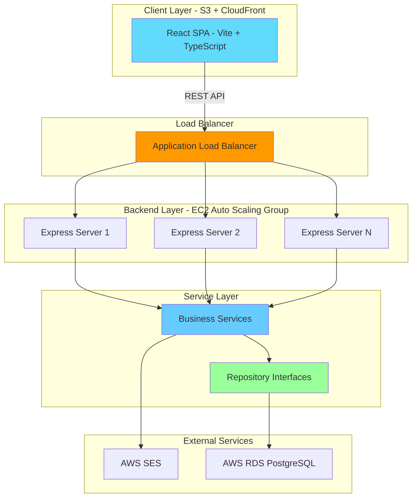
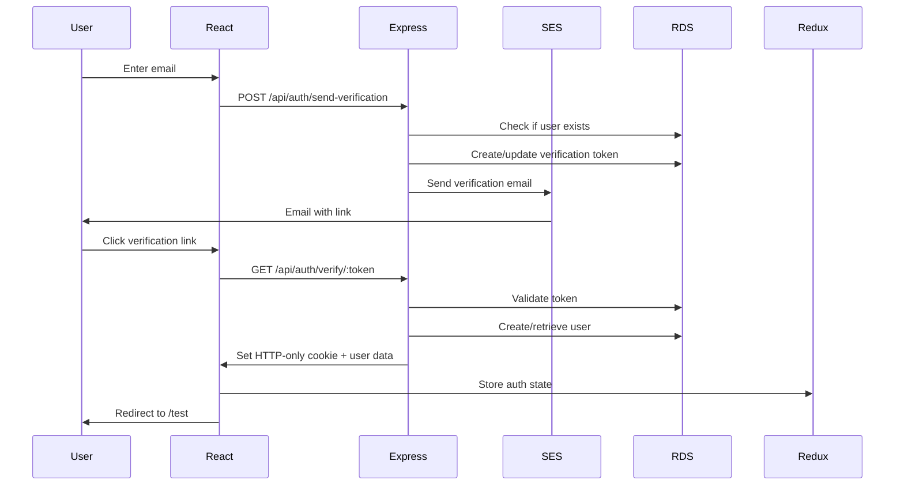

# Design Document

## Overview

The Halloween Personality Test is a full-stack application with a React frontend and Express.js backend that provides a themed MBTI personality assessment. The architecture uses a feature flag system to support both simple (no authentication) and advanced (email-verified with history) modes from a single codebase. The design emphasizes modularity through service abstraction layers, allowing future changes to AWS infrastructure without impacting business logic.

## Architecture

### High-Level Architecture



### Technology Stack

#### Frontend
- **Framework**: React 18+ with Vite
- **Language**: TypeScript
- **State Management**: Redux Toolkit
- **Styling**: Tailwind CSS with custom dark/spooky theme
- **HTTP Client**: Axios
- **Routing**: React Router v6
- **Deployment**: S3 Static Website Hosting + CloudFront CDN

#### Backend
- **Framework**: Express.js with TypeScript
- **Architecture**: MVC Pattern
- **Database**: AWS RDS (PostgreSQL) with connection pooling (`pg` library)
- **Email**: AWS SES
- **Session Management**: JWT tokens in HTTP-only cookies
- **Validation**: Joi for request validation
- **Deployment**: EC2 instances behind ALB with Auto Scaling Group

### Feature Flag System

Both frontend and backend use environment variables to control feature availability:

**Frontend (React)**
```typescript
// src/config/features.ts
export const features = {
  emailAuth: import.meta.env.VITE_ENABLE_EMAIL_AUTH === 'true',
}
```

**Backend (Express)**
```typescript
// src/config/features.ts
export const features = {
  emailAuth: process.env.ENABLE_EMAIL_AUTH === 'true',
}
```

### Communication Architecture

**Frontend → Backend Communication**
- React app makes REST API calls to Express backend
- Backend URL configured via environment variable: `VITE_API_URL`
- Authentication via HTTP-only cookies set by backend
- CORS enabled for localhost development

**Cookie Security**
- HTTP-only cookies (JavaScript cannot access)
- Secure flag in production (HTTPS only)
- SameSite=Strict to prevent CSRF
- Backend sets and validates cookies

## Frontend Architecture (React + Vite)

### Project Structure

```
frontend/
├── src/
│   ├── components/          # Reusable UI components
│   │   ├── TestQuestion.tsx
│   │   ├── ProgressIndicator.tsx
│   │   ├── CharacterResult.tsx
│   │   └── EmailVerificationForm.tsx
│   ├── pages/              # Route pages
│   │   ├── HomePage.tsx
│   │   ├── TestPage.tsx
│   │   ├── ResultsPage.tsx
│   │   ├── EmailEntryPage.tsx
│   │   ├── VerifyPage.tsx
│   │   └── ProfilePage.tsx
│   ├── store/              # Redux store
│   │   ├── slices/
│   │   │   ├── testSlice.ts
│   │   │   └── authSlice.ts
│   │   └── store.ts
│   ├── services/           # API service layer
│   │   ├── api.ts          # Axios instance
│   │   ├── authService.ts
│   │   └── testService.ts
│   ├── types/              # TypeScript types
│   ├── config/             # Configuration
│   │   └── features.ts
│   ├── assets/             # Static assets
│   │   └── characters/     # Character images
│   ├── data/               # Static data
│   │   ├── questions.json
│   │   └── character-descriptions.json
│   ├── App.tsx
│   └── main.tsx
├── public/
├── index.html
├── vite.config.ts
├── tailwind.config.ts
└── package.json
```

### Routing Structure

#### Simple Mode Flow
```
/ (Home) → /test → /results
```

#### Advanced Mode Flow
```
/ (Home) → /auth/email → /auth/verify → /test → /results → /profile
```

### React Router Configuration

```typescript
// App.tsx
import { BrowserRouter, Routes, Route, Navigate } from 'react-router-dom';
import { features } from './config/features';

function App() {
  return (
    <BrowserRouter>
      <Routes>
        <Route path="/" element={<HomePage />} />
        <Route path="/test" element={<ProtectedRoute><TestPage /></ProtectedRoute>} />
        <Route path="/results" element={<ResultsPage />} />
        
        {features.emailAuth && (
          <>
            <Route path="/auth/email" element={<EmailEntryPage />} />
            <Route path="/auth/verify" element={<VerifyPage />} />
            <Route path="/profile" element={<ProtectedRoute><ProfilePage /></ProtectedRoute>} />
          </>
        )}
        
        <Route path="*" element={<Navigate to="/" />} />
      </Routes>
    </BrowserRouter>
  );
}
```

## Backend Architecture (Express.js)

### Project Structure (MVC Pattern)

```
backend/
├── src/
│   ├── controllers/        # Request handlers
│   │   ├── authController.ts
│   │   ├── testController.ts
│   │   └── profileController.ts
│   ├── models/             # Data models (interfaces)
│   │   ├── User.ts
│   │   ├── TestResult.ts
│   │   └── VerificationToken.ts
│   ├── services/           # Business logic
│   │   ├── interfaces/     # Service interfaces
│   │   │   ├── IEmailService.ts
│   │   │   ├── IUserRepository.ts
│   │   │   └── ITestResultRepository.ts
│   │   ├── implementations/
│   │   │   ├── SESEmailService.ts
│   │   │   ├── PostgresUserRepository.ts
│   │   │   └── PostgresTestResultRepository.ts
│   │   ├── AuthService.ts
│   │   └── TestScoringService.ts
│   ├── routes/             # Express routes
│   │   ├── authRoutes.ts
│   │   ├── testRoutes.ts
│   │   └── profileRoutes.ts
│   ├── middleware/         # Express middleware
│   │   ├── authMiddleware.ts
│   │   ├── errorHandler.ts
│   │   └── validateRequest.ts
│   ├── database/           # Database layer
│   │   ├── connection.ts   # PostgreSQL connection pool
│   │   └── migrations/     # SQL migration files
│   ├── config/             # Configuration
│   │   ├── database.ts
│   │   ├── aws.ts
│   │   └── features.ts
│   ├── utils/              # Utilities
│   │   ├── jwt.ts
│   │   └── validation.ts
│   └── app.ts              # Express app setup
├── server.ts               # Entry point
├── tsconfig.json
└── package.json
```

### Express Routes

```typescript
// src/routes/authRoutes.ts
POST   /api/auth/send-verification    # Send verification email
GET    /api/auth/verify-token         # Verify token and create session
POST   /api/auth/logout               # Clear session

// src/routes/testRoutes.ts
GET    /api/test/questions            # Get all questions
POST   /api/test/submit               # Submit test answers, get result

// src/routes/profileRoutes.ts
GET    /api/profile/history           # Get user's test history
GET    /api/profile/me                # Get current user info
```

### Core React Components

#### TestQuestion Component
```typescript
interface TestQuestionProps {
  question: Question;
  selectedAnswer: string | null;
  onAnswer: (answerId: string) => void;
}
```

Displays a single question with two answer options. Handles user selection and visual feedback.

#### ProgressIndicator Component
```typescript
interface ProgressIndicatorProps {
  currentPage: number;
  totalPages: number;
}
```

Shows test progress (e.g., "1/3", "2/3", "3/3") with visual bar.

#### CharacterResult Component
```typescript
interface CharacterResultProps {
  character: HalloweenCharacter;
  description: string;
  showRetakeButton: boolean;
  showProfileButton: boolean; // Only in advanced mode
}
```

Displays the Halloween character result with image and description.

#### EmailVerificationForm Component
```typescript
interface EmailVerificationFormProps {
  onSubmit: (email: string) => Promise<void>;
  isLoading: boolean;
}
```

Handles email input and validation (advanced mode only).

### Redux Store Structure

```typescript
// store/store.ts
interface RootState {
  test: TestState;
  auth: AuthState;
}

interface TestState {
  questions: Question[];
  answers: Record<string, string>;
  currentPage: number;
  result: TestResult | null;
  loading: boolean;
  error: string | null;
}

interface AuthState {
  isAuthenticated: boolean;
  user: User | null;
  loading: boolean;
  error: string | null;
}
```

### API Service Layer (Frontend)

```typescript
// services/api.ts
import axios from 'axios';

const api = axios.create({
  baseURL: import.meta.env.VITE_API_URL,
  withCredentials: true, // Send cookies with requests
  headers: {
    'Content-Type': 'application/json',
  },
});

// services/authService.ts
export const authService = {
  sendVerification: (email: string) => api.post('/auth/send-verification', { email }),
  verifyToken: (token: string) => api.get(`/auth/verify-token?token=${token}`),
  logout: () => api.post('/auth/logout'),
};

// services/testService.ts
export const testService = {
  getQuestions: () => api.get('/test/questions'),
  submitTest: (answers: Answer[]) => api.post('/test/submit', { answers }),
  getHistory: () => api.get('/profile/history'),
};
```

### Service Abstraction Layer (Backend)

#### IEmailService Interface
```typescript
interface IEmailService {
  sendVerificationEmail(email: string, token: string): Promise<void>;
  sendResultEmail(email: string, character: HalloweenCharacter): Promise<void>;
}

// Implementations:
// - SESEmailService (AWS SES via aws-sdk)
// - NoOpEmailService (simple mode)
```

#### IUserRepository Interface
```typescript
interface IUserRepository {
  findByEmail(email: string): Promise<User | null>;
  create(email: string): Promise<User>;
  updateLastLogin(userId: string): Promise<void>;
}

// Implementations:
// - PostgresUserRepository (Raw SQL with pg pool)
// - NoOpUserRepository (simple mode)
```

#### ITestResultRepository Interface
```typescript
interface ITestResultRepository {
  create(result: TestResultInput): Promise<TestResult>;
  findByUserId(userId: string): Promise<TestResult[]>;
}

// Implementations:
// - PostgresTestResultRepository (Raw SQL with pg pool)
// - NoOpTestResultRepository (simple mode)
```

#### IDatabaseConnection Interface
```typescript
interface IDatabaseConnection {
  query<T>(sql: string, params?: any[]): Promise<T[]>;
  getClient(): Promise<PoolClient>;
  end(): Promise<void>;
}

// Implementations:
// - PostgresConnection (pg Pool)
// - Future: Could swap to Aurora, add API Gateway layer, etc.
```

### 5. Business Logic Services (Backend)

#### TestScoringService
```typescript
class TestScoringService {
  calculatePersonality(answers: Answer[]): MBTIType {
    // Calculate E/I, N/S, T/F based on majority vote
  }
  
  mapToCharacter(mbtiType: MBTIType): HalloweenCharacter {
    // Map MBTI to Halloween character
  }
}
```

#### AuthService (Advanced Mode)
```typescript
class AuthService {
  constructor(
    private emailService: IEmailService,
    private userRepository: IUserRepository
  ) {}
  
  async sendVerification(email: string): Promise<void> {
    // Generate token, send email
  }
  
  async verifyToken(token: string): Promise<User> {
    // Verify token, return user
  }
  
  async createSession(user: User): Promise<string> {
    // Create JWT session token
  }
}
```

## Data Models

### Question Model
```typescript
interface Question {
  id: string;
  text: string; // Korean text
  dimension: 'EI' | 'NS' | 'TF';
  answers: [
    {
      id: string;
      text: string; // Korean text
      value: 'E' | 'I' | 'N' | 'S' | 'T' | 'F';
    },
    {
      id: string;
      text: string;
      value: 'E' | 'I' | 'N' | 'S' | 'T' | 'F';
    }
  ];
}
```

### HalloweenCharacter Model
```typescript
type HalloweenCharacter = 
  | 'zombie'      // 좀비
  | 'joker'       // 조커
  | 'skeleton'    // 해골
  | 'nun'         // 수녀
  | 'jack-o-lantern' // 잭오랜턴
  | 'vampire'     // 뱀파이어
  | 'ghost'       // 유령
  | 'frankenstein'; // 프랑켄슈타인

interface CharacterInfo {
  name: string; // Korean name
  description: string; // Korean description
  imagePath: string;
  mbtiTypes: [string, string]; // e.g., ['ESTJ', 'ESTP']
}
```

### User Model (Advanced Mode)
```typescript
interface User {
  id: string;
  email: string;
  createdAt: Date;
  updatedAt: Date;
}
```

### TestResult Model (Advanced Mode)
```typescript
interface TestResult {
  id: string;
  userId: string;
  characterType: HalloweenCharacter;
  mbtiType: string; // Full MBTI (e.g., 'ESTJ')
  completedAt: Date;
}
```

### VerificationToken Model (Advanced Mode)
```typescript
interface VerificationToken {
  token: string;
  email: string;
  expiresAt: Date;
  used: boolean;
}
```

## Database Schema (Advanced Mode)

### Users Table
```sql
CREATE TABLE users (
  id UUID PRIMARY KEY DEFAULT gen_random_uuid(),
  email VARCHAR(255) UNIQUE NOT NULL,
  created_at TIMESTAMP DEFAULT CURRENT_TIMESTAMP,
  updated_at TIMESTAMP DEFAULT CURRENT_TIMESTAMP
);

CREATE INDEX idx_users_email ON users(email);
```

### Test Results Table
```sql
CREATE TABLE test_results (
  id UUID PRIMARY KEY DEFAULT gen_random_uuid(),
  user_id UUID NOT NULL REFERENCES users(id) ON DELETE CASCADE,
  character_type VARCHAR(50) NOT NULL,
  mbti_type VARCHAR(4) NOT NULL,
  completed_at TIMESTAMP DEFAULT CURRENT_TIMESTAMP
);

CREATE INDEX idx_test_results_user_id ON test_results(user_id);
CREATE INDEX idx_test_results_completed_at ON test_results(completed_at DESC);
```

### Verification Tokens Table
```sql
CREATE TABLE verification_tokens (
  token VARCHAR(255) PRIMARY KEY,
  email VARCHAR(255) NOT NULL,
  expires_at TIMESTAMP NOT NULL,
  used BOOLEAN DEFAULT FALSE,
  created_at TIMESTAMP DEFAULT CURRENT_TIMESTAMP
);

CREATE INDEX idx_verification_tokens_email ON verification_tokens(email);
CREATE INDEX idx_verification_tokens_expires_at ON verification_tokens(expires_at);
```

## Question Bank Design

### Question Distribution
- **5 questions for E/I dimension**: Social energy, interaction preferences
- **5 questions for N/S dimension**: Information processing, abstract vs concrete thinking
- **5 questions for T/F dimension**: Decision-making, logic vs values

### Question Structure (Korean)
```json
{
  "questions": [
    {
      "id": "ei_1",
      "text": "주말에 에너지를 충전하는 방법은?",
      "dimension": "EI",
      "answers": [
        {
          "id": "ei_1_a",
          "text": "친구들과 만나서 활동적으로 보낸다",
          "value": "E"
        },
        {
          "id": "ei_1_b",
          "text": "집에서 혼자 조용히 쉰다",
          "value": "I"
        }
      ]
    }
  ]
}
```

### Scoring Algorithm
```typescript
function calculateDimension(answers: Answer[], dimension: 'EI' | 'NS' | 'TF'): string {
  const dimensionAnswers = answers.filter(a => a.dimension === dimension);
  const counts = dimensionAnswers.reduce((acc, answer) => {
    acc[answer.value] = (acc[answer.value] || 0) + 1;
    return acc;
  }, {} as Record<string, number>);
  
  // Return the value with more votes
  const [first, second] = dimension.split('');
  return (counts[first] || 0) >= (counts[second] || 0) ? first : second;
}
```

## API Endpoints (Express Backend)

### Authentication Routes
```
POST   /api/auth/send-verification    # Send verification email
GET    /api/auth/verify/:token        # Verify email token
POST   /api/auth/logout               # Logout user
```

### Test Routes
```
GET    /api/test/questions            # Get all questions
POST   /api/test/submit               # Submit test answers
```

### Profile Routes (Advanced Mode)
```
GET    /api/profile/me                # Get current user
GET    /api/profile/history           # Get test history
```

## Routing and Navigation (React Frontend)

### React Router Configuration
```typescript
// App.tsx
import { BrowserRouter, Routes, Route, Navigate } from 'react-router-dom';

function App() {
  return (
    <BrowserRouter>
      <Routes>
        <Route path="/" element={<HomePage />} />
        <Route path="/test" element={
          features.emailAuth ? <ProtectedRoute><TestPage /></ProtectedRoute> : <TestPage />
        } />
        <Route path="/results" element={<ResultsPage />} />
        
        {features.emailAuth && (
          <>
            <Route path="/auth/email" element={<EmailEntryPage />} />
            <Route path="/auth/verify/:token" element={<VerifyPage />} />
            <Route path="/profile" element={<ProtectedRoute><ProfilePage /></ProtectedRoute>} />
          </>
        )}
        
        <Route path="*" element={<Navigate to="/" />} />
      </Routes>
    </BrowserRouter>
  );
}
```

### Protected Route Component
```typescript
// components/ProtectedRoute.tsx
function ProtectedRoute({ children }: { children: React.ReactNode }) {
  const { isAuthenticated } = useSelector((state: RootState) => state.auth);
  const navigate = useNavigate();
  
  useEffect(() => {
    if (!isAuthenticated) {
      navigate('/auth/email');
    }
  }, [isAuthenticated, navigate]);
  
  return isAuthenticated ? <>{children}</> : null;
}
```

### Backend Middleware (Express)
```typescript
// middleware/authMiddleware.ts
export function requireAuth(req: Request, res: Response, next: NextFunction) {
  if (!features.emailAuth) {
    return next(); // Skip auth in simple mode
  }
  
  const token = req.cookies.session_token;
  if (!token) {
    return res.status(401).json({ error: 'Unauthorized' });
  }
  
  try {
    const decoded = verifyJWT(token);
    req.user = decoded;
    next();
  } catch (error) {
    res.status(401).json({ error: 'Invalid token' });
  }
}
```

## Authentication Flow (Advanced Mode)

### Email Verification Flow


### Session Management
- JWT tokens stored in HTTP-only cookies (set by Express backend)
- Token expiration: 24 hours
- Token payload: `{ userId, email, iat, exp }`
- Cookies sent automatically with each request via Axios withCredentials
- Refresh mechanism: Re-verify email after expiration

### CORS Configuration
```typescript
// backend/src/app.ts
import cors from 'cors';

app.use(cors({
  origin: process.env.FRONTEND_URL || 'http://localhost:5173',
  credentials: true, // Allow cookies
  methods: ['GET', 'POST', 'PUT', 'DELETE'],
  allowedHeaders: ['Content-Type', 'Authorization']
}));
```

### Axios Configuration (Frontend)
```typescript
// frontend/src/services/api.ts
import axios from 'axios';

const api = axios.create({
  baseURL: import.meta.env.VITE_API_URL,
  withCredentials: true, // Send cookies with requests
  headers: {
    'Content-Type': 'application/json'
  }
});

export default api;
```

## Error Handling

### Error Types
```typescript
class AppError extends Error {
  constructor(
    public code: string,
    public message: string,
    public statusCode: number
  ) {
    super(message);
  }
}

// Specific error classes
class ValidationError extends AppError {}
class AuthenticationError extends AppError {}
class DatabaseError extends AppError {}
class EmailServiceError extends AppError {}
```

### Error Handling Strategy
1. **API Routes**: Catch errors, log, return appropriate HTTP status with Korean error messages
2. **Client Components**: Display user-friendly error messages in Korean
3. **Service Layer**: Throw typed errors that can be handled by API routes
4. **Repository Layer**: Wrap database errors in DatabaseError

### Error Messages (Korean)
```typescript
const errorMessages = {
  INVALID_EMAIL: '유효하지 않은 이메일 주소입니다.',
  TOKEN_EXPIRED: '인증 링크가 만료되었습니다. 다시 시도해주세요.',
  TOKEN_INVALID: '유효하지 않은 인증 링크입니다.',
  DATABASE_ERROR: '서버 오류가 발생했습니다. 잠시 후 다시 시도해주세요.',
  EMAIL_SEND_FAILED: '이메일 전송에 실패했습니다. 다시 시도해주세요.',
  INCOMPLETE_ANSWERS: '모든 질문에 답변해주세요.',
};
```

## Testing Strategy

### Unit Tests
- **Service Layer**: Test business logic in isolation with mocked dependencies
- **Scoring Algorithm**: Test all MBTI combinations map correctly to characters
- **Validation**: Test email validation, answer validation

### Integration Tests
- **API Routes**: Test with mocked database and email service
- **Repository Layer**: Test with test database
- **Authentication Flow**: Test token generation and verification

### E2E Tests
- **Simple Mode**: Complete test flow from landing to results
- **Advanced Mode**: Email verification → test → results → profile view
- **Responsive Design**: Test on mobile, tablet, desktop viewports

### Test Tools
- **Unit/Integration**: Jest + React Testing Library
- **E2E**: Playwright
- **API Testing**: Supertest

## UI/UX Design

### Theme Configuration
```typescript
// tailwind.config.ts
export default {
  theme: {
    extend: {
      colors: {
        halloween: {
          dark: '#0a0a0a',
          darker: '#050505',
          orange: '#ff6b35',
          purple: '#6a0dad',
          green: '#39ff14',
          blood: '#8b0000',
        }
      },
      fontFamily: {
        spooky: ['Creepster', 'cursive'],
        korean: ['Noto Sans KR', 'sans-serif'],
      }
    }
  }
}
```

### Component Styling Patterns
- Dark background with subtle texture (cobwebs, fog)
- Orange/purple accent colors for buttons and highlights
- Smooth transitions and hover effects
- Glowing effects for interactive elements
- Responsive typography scaling

### Animation Effects
- Fade-in for page transitions
- Pulse effect for CTA buttons
- Floating animation for character images
- Progress bar fill animation
- Spooky hover effects (slight shake, glow)

## Redux State Management (Frontend)

### Store Structure
```typescript
// store/store.ts
import { configureStore } from '@reduxjs/toolkit';
import testReducer from './slices/testSlice';
import authReducer from './slices/authSlice';

export const store = configureStore({
  reducer: {
    test: testReducer,
    auth: authReducer,
  },
});

export type RootState = ReturnType<typeof store.getState>;
export type AppDispatch = typeof store.dispatch;
```

### Test Slice
```typescript
// store/slices/testSlice.ts
interface TestState {
  questions: Question[];
  answers: Record<string, string>;
  currentPage: number;
  result: HalloweenCharacter | null;
  isLoading: boolean;
}

// Actions: setAnswer, nextPage, prevPage, submitTest, resetTest
```

### Auth Slice
```typescript
// store/slices/authSlice.ts
interface AuthState {
  isAuthenticated: boolean;
  user: User | null;
  isLoading: boolean;
  error: string | null;
}

// Actions: login, logout, checkAuth, setUser
```

## Database Connection (Backend)

### PostgreSQL Connection Pool
```typescript
// db/pool.ts
import { Pool, PoolConfig } from 'pg';

const poolConfig: PoolConfig = {
  host: process.env.DB_HOST,
  port: parseInt(process.env.DB_PORT || '5432'),
  database: process.env.DB_NAME,
  user: process.env.DB_USER,
  password: process.env.DB_PASSWORD,
  max: 20, // Maximum pool size
  idleTimeoutMillis: 30000,
  connectionTimeoutMillis: 2000,
};

export const pool = new Pool(poolConfig);

// Implement IDatabaseConnection interface
export class PostgresConnection implements IDatabaseConnection {
  async query<T>(sql: string, params?: any[]): Promise<T[]> {
    const result = await pool.query(sql, params);
    return result.rows as T[];
  }
  
  async getClient() {
    return await pool.connect();
  }
  
  async end() {
    await pool.end();
  }
}
```

## Performance Considerations

### Frontend Optimization
1. **Code Splitting**: Lazy load routes with React.lazy()
2. **Image Optimization**: Optimize character images, use WebP format
3. **Bundle Size**: Tree-shaking with Vite, analyze bundle with rollup-plugin-visualizer
4. **Caching**: Cache static assets in CloudFront with long TTL
5. **Memoization**: Use React.memo for expensive components

### Backend Optimization
1. **Connection Pooling**: pg Pool with 20 max connections
2. **Database Indexing**: Index email, user_id columns
3. **Response Compression**: Use compression middleware
4. **Caching**: Cache questions in memory (they don't change)
5. **Load Balancing**: ALB distributes traffic across EC2 instances

### Loading States
- Skeleton loaders for test questions
- Spinner for email verification
- Progress indicator during result calculation
- Optimistic UI updates where possible

## Security Considerations

### Authentication Security
- HTTP-only cookies for session tokens
- CSRF protection for API routes
- Token expiration and rotation
- Rate limiting on email sending (prevent spam)

### Data Security
- Email validation and sanitization
- SQL injection prevention (parameterized queries)
- XSS prevention (React's built-in escaping)
- Environment variable protection (never expose in client)

### AWS Security
- IAM roles with minimal permissions
- SES sandbox mode for testing
- RDS security groups (restrict access)
- Encrypted connections (SSL/TLS)

## Deployment Architecture

### Frontend Deployment (S3 + CloudFront)
```
1. Build React app: npm run build
2. Upload dist/ to S3 bucket
3. Configure S3 for static website hosting
4. Create CloudFront distribution pointing to S3
5. Configure CloudFront caching and compression
6. Set up custom domain with Route 53 (optional)
```

### Backend Deployment (EC2 + ALB + ASG)
```
1. Create EC2 launch template with Node.js + Express app
2. Set up Application Load Balancer
3. Configure Auto Scaling Group (min: 2, max: 10)
4. Configure health checks on ALB
5. Set up security groups (ALB → EC2, EC2 → RDS)
6. Deploy Express app via PM2 or Docker
```

### Environment Variables

**Frontend (.env.production):**
```bash
VITE_ENABLE_EMAIL_AUTH=false
VITE_API_URL=https://api.your-domain.com/api
```

**Backend (.env):**
```bash
# Feature Flags
ENABLE_EMAIL_AUTH=false

# Server
PORT=3000
NODE_ENV=production
FRONTEND_URL=https://your-domain.com

# Database (Advanced Mode)
DB_HOST=your-rds-endpoint.rds.amazonaws.com
DB_PORT=5432
DB_NAME=halloween_test
DB_USER=admin
DB_PASSWORD=your-password

# AWS (Advanced Mode)
AWS_REGION=us-east-1
AWS_SES_FROM_EMAIL=noreply@your-domain.com
AWS_ACCESS_KEY_ID=xxx
AWS_SECRET_ACCESS_KEY=xxx

# JWT
JWT_SECRET=your-secret-key-min-32-chars
JWT_EXPIRES_IN=24h

# CORS
ALLOWED_ORIGINS=https://your-domain.com,http://localhost:5173
```

### Deployment Checklist
1. **Database**: Run migrations on RDS PostgreSQL
2. **AWS SES**: Verify sender email address
3. **Backend**: Deploy Express to EC2, configure ALB health checks
4. **Frontend**: Build and upload to S3, configure CloudFront
5. **DNS**: Point domain to CloudFront and ALB
6. **SSL**: Configure SSL certificates in ACM
7. **Monitoring**: Set up CloudWatch logs and alarms
8. **Testing**: Test email delivery, load balancing, auto-scaling

## Future Extensibility

### Potential Enhancements
1. **Multiple Languages**: Add i18n support beyond Korean
2. **Social Sharing**: Add share buttons for results
3. **Analytics**: Track completion rates, popular characters
4. **Admin Dashboard**: View statistics, manage questions
5. **Alternative Storage**: Swap RDS for DynamoDB or Aurora
6. **Alternative Email**: Swap SES for SendGrid or Mailgun
7. **OAuth Login**: Add Google/Kakao login alongside email

### Architecture Support for Changes
- Service interfaces allow swapping implementations
- Feature flags enable gradual rollout
- Modular component structure supports UI changes
- Separated business logic from infrastructure concerns
